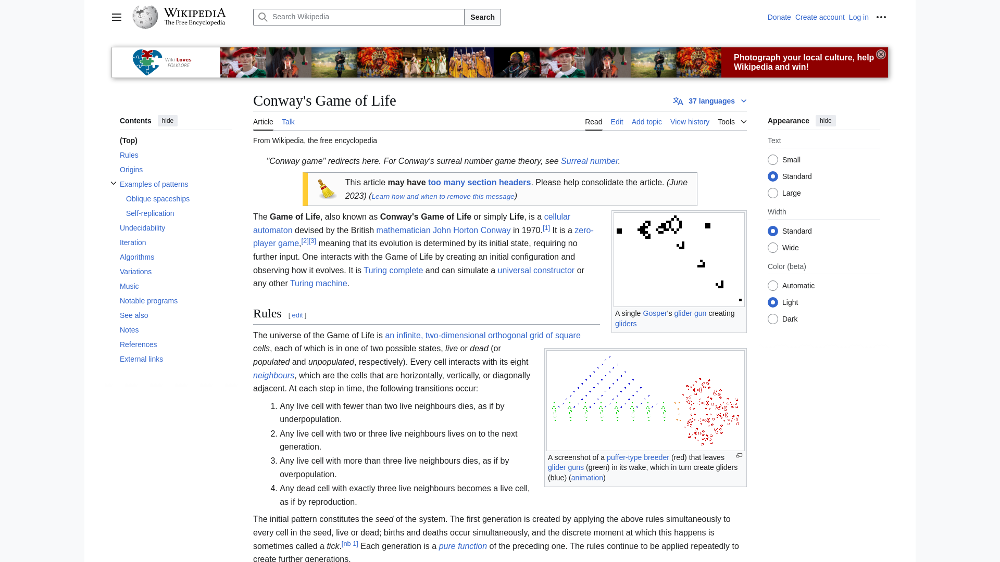

# Conway's Game of Life

An interactive implementation of [Conway's Game of Life](https://en.wikipedia.org/wiki/Conway%27s_Game_of_Life) with colorful cell visualization, high score tracking, and pattern detection.



## Features

- **Colorful cell visualization**: Each cell has a unique color, and new cells inherit colors from their neighbors
- **Interactive painting interface**: Click and drag to easily create and erase cells
- **Responsive grid size**: Adjust the grid size from 10×10 up to 50×50
- **Game controls**: Start/stop the simulation, control speed, step through generations manually
- **Random generation**: Create random starting patterns with a single click
- **Game statistics**: Track generations, living cells count, and population density
- **High score system**: Records your best achievements for maximum generations, maximum population, and longest surviving pattern
- **All-time best scores**: View the best records across all game sessions

## Game Rules

Conway's Game of Life follows these simple rules:

1. Any live cell with fewer than two live neighbors dies (underpopulation)
2. Any live cell with two or three live neighbors lives on
3. Any live cell with more than three live neighbors dies (overpopulation)
4. Any dead cell with exactly three live neighbors becomes a live cell (reproduction)

## Getting Started

### Prerequisites

- Node.js (v14 or higher)
- npm (v6 or higher)

### Installation

1. Clone this repository:
   ```
   git clone https://github.com/yourusername/conways-game-of-life.git
   cd conways-game-of-life
   ```

2. Install dependencies:
   ```
   npm install
   ```

3. Start the development server:
   ```
   npm run dev
   ```

4. Open your browser and navigate to `http://localhost:5000`

## How to Play

1. **Create initial pattern**:
   - Click and drag on the grid to draw live cells
   - Click on a live cell and drag to erase cells
   - Use the "Random" button to generate a random pattern
   - Use the "Clear" button to reset the grid

2. **Control the simulation**:
   - Click "Start" to begin the simulation
   - Use the speed slider to control how fast generations progress
   - Click "Stop" to pause the simulation
   - Use "Step" to advance one generation at a time

3. **Adjust the grid**:
   - Use the "+" and "-" buttons on the grid to change its size

4. **Game ending conditions**:
   - The game stops when all cells die
   - The game stops when a pattern stabilizes for 10 generations

## Technologies Used

- **Frontend**: React, TypeScript, TailwindCSS, shadcn/ui
- **Backend**: Express.js, TypeScript
- **State Management**: TanStack Query
- **Styling**: Tailwind CSS
- **Data Storage**: In-memory storage

## License

This project is licensed under the MIT License - see the LICENSE file for details.

## Acknowledgments

- John Horton Conway for creating the Game of Life
- The React and TypeScript communities for their excellent tools and documentation