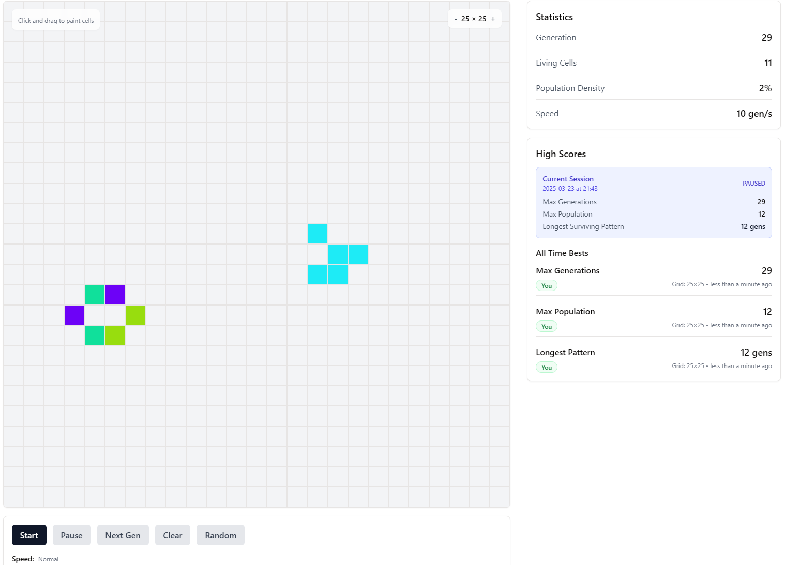
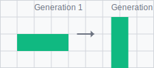
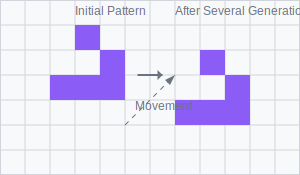

# Conway's Game of Life

An interactive implementation of [Conway's Game of Life](https://en.wikipedia.org/wiki/Conway%27s_Game_of_Life) with colorful cell visualization, high score tracking, and pattern detection.



## What is Conway's Game of Life?

Conway's Game of Life is a cellular automaton devised by mathematician John Horton Conway in 1970. Despite its name, it's not a traditional game with players competing against each other. Instead, it's a fascinating "zero-player game" where patterns evolve based on simple rules.

### History and Purpose

John Conway created the Game of Life as an attempt to simplify earlier ideas in cellular automata theory. He wanted to find a set of simple rules that could lead to interesting and complex behaviors, including the possibility of self-replicating patterns.

The game quickly became popular among computer scientists, mathematicians, and hobbyists after it was featured in Martin Gardner's "Mathematical Games" column in Scientific American in October 1970. It has since become one of the most well-known examples of how complex patterns and behaviors can emerge from very simple rules.

### Why It Matters

The Game of Life demonstrates several important concepts:
- **Emergence**: Complex patterns arise from simple rules
- **Unpredictability**: Even with deterministic rules, outcomes can be impossible to predict without running the simulation
- **Self-organization**: Ordered structures can form spontaneously from random starting conditions

It has applications in various fields including computer science, biology, physics, and philosophy, serving as a model for studying complex systems and emergent behavior.

## Features

- **Colorful cell visualization**: Each cell has a unique color, and new cells inherit colors from their neighbors
- **Interactive painting interface**: Click and drag to easily create and erase cells
- **Responsive grid size**: Adjust the grid size from 10×10 up to 50×50
- **Game controls**: Start/stop the simulation, control speed, step through generations manually
- **Random generation**: Create random starting patterns with a single click
- **Game statistics**: Track generations, living cells count, and population density
- **High score system**: Records your best achievements for maximum generations, maximum population, and longest surviving pattern
- **All-time best scores**: View the best records across all game sessions
- **Shareable patterns**: Copy a link to share your current grid

## Game Rules

Conway's Game of Life follows these simple rules:

1. Any live cell with fewer than two live neighbors dies (underpopulation)
2. Any live cell with two or three live neighbors lives on
3. Any live cell with more than three live neighbors dies (overpopulation)
4. Any dead cell with exactly three live neighbors becomes a live cell (reproduction)

## Getting Started

### Prerequisites

- Node.js (v14 or higher)
- npm (v6 or higher)

### Installation

1. Clone this repository:
   ```
   git clone https://github.com/yourusername/conways-game-of-life.git
   cd conways-game-of-life
   ```

2. Install dependencies:
   ```
   npm install
   ```

3. Start the development server:
   ```
   npm run dev
   ```

4. Open your browser and navigate to `http://localhost:5000`

### Environment Variables

`VITE_BASE_URL` sets the base URL used by Vite when building for production.
If not specified, Vite defaults to `/`.
When deploying to GitHub Pages, set it to your repository name. For example:

```bash
VITE_BASE_URL=/GameOfLifeTracker/
npm run build
```

### Database Setup

Set a `DATABASE_URL` environment variable pointing to your PostgreSQL instance.
Run the migrations with:

```bash
npm run db:push
```

When `DATABASE_URL` is provided, the server will use the database for persisting high scores.

## How to Play

1. **Create initial pattern**:
   - Click and drag on the grid to draw live cells
   - Click on a live cell and drag to erase cells
   - Use the "Random" button to generate a random pattern
   - Use the "Clear" button to reset the grid

2. **Control the simulation**:
   - Click "Start" to begin the simulation
   - Use the speed slider to control how fast generations progress
   - Click "Stop" to pause the simulation
   - Use "Step" to advance one generation at a time
   - Click "Share" to copy a link to your current pattern

3. **Adjust the grid**:
   - Use the "+" and "-" buttons on the grid to change its size

4. **Game ending conditions**:
   - The game stops when all cells die
   - The game stops when a pattern stabilizes for 10 generations

## Famous Patterns to Try

The Game of Life has many well-known patterns you can try creating:

### Still Lifes (Stable Patterns)
- **Block**: A 2×2 square of cells

  
  
- **Beehive**: A hexagonal arrangement of 6 cells

  
  
- **Loaf**: A stable pattern resembling a loaf of bread

### Oscillators (Repeating Patterns)
- **Blinker**: A row of 3 cells that alternates between horizontal and vertical

  
  
- **Toad**: A pattern that oscillates between two states
- **Pulsar**: A complex pattern with a period of 3

### Spaceships (Moving Patterns)
- **Glider**: The simplest pattern that moves diagonally across the grid

  
  
- **Lightweight Spaceship (LWSS)**: A small pattern that moves horizontally

### Guns and Infinite Growth
- **Gosper Glider Gun**: Creates an endless stream of gliders
- **Puffer Train**: Moves while leaving behind debris that evolves

### Sharing Patterns

Use the **Share** button to copy a link representing your current grid. Opening
that link will load the pattern automatically.

## Technologies Used

- **Frontend**: React, TypeScript, TailwindCSS, shadcn/ui
- **Backend**: Express.js, TypeScript
- **State Management**: TanStack Query
- **Styling**: Tailwind CSS
- **Data Storage**: In-memory or PostgreSQL storage via Drizzle ORM

## Testing

Run all unit tests with:

```bash
npm test
```

## Deploying to GitHub Pages

The project includes a `GitHubPagesApp` that stores high scores in your browser's `localStorage`. To deploy this static version:

1. Run the GitHub Actions workflow, or build manually with:
   ```bash
   VITE_BASE_URL=/repo-name/ npm run build
   ```
2. Push the contents of `dist/public` to the `gh-pages` branch.

The site will then be served from `https://<user>.github.io/repo-name/`.

## License

This project is licensed under the MIT License - see the [LICENSE](LICENSE) file for details.

## Acknowledgments

- John Horton Conway for creating the Game of Life
- The React and TypeScript communities for their excellent tools and documentation
